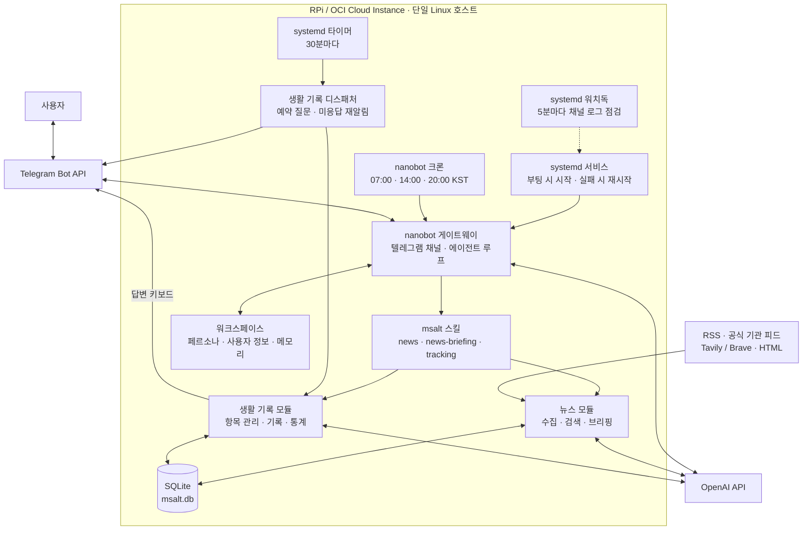

# my-nanobot-rpi

nanobot 포크 기반 개인 AI 비서 — 경제 뉴스 브리핑 + 추적 항목 기반 생활 기록

## 개요

nanobot 프레임워크를 기반으로 RPi / OCI Cloud Instance에서 구동되는 개인 비서.
현재는 OCI Ubuntu 인스턴스에서 운영하며, 라즈베리파이 3B+ 배포도 지원한다.
텔레그램을 통해 경제 뉴스 브리핑과 사용자 정의 추적 항목 기록 기능을 제공한다.

## 주요 기능

### 1. 경제 뉴스 비서

**데이터 소스**

일반 RSS 7개와 공식 기관 피드 3개를 기본으로 수집하고, 검색 API와 HTML 보완 수집을 함께 사용한다.

| 카테고리 | 소스 | URL |
|---------|------|-----|
| 국내 | 한국경제 | `hankyung.com/feed/economy` |
| 국내 | 매일경제 | `mk.co.kr/rss/30100041/` |
| 국내 | 경향신문 경제 | `khan.co.kr/rss/rssdata/economy_news.xml` |
| 해외 | BBC Business | `feeds.bbci.co.uk/news/business/rss.xml` |
| 해외 | CNBC Top News | `search.cnbc.com/rs/search/combinedcms/view.xml` |
| 정책·지표 | Fed Monetary Policy | `federalreserve.gov/feeds/press_monetary.xml` |
| 정책·지표 | Investing.com Indicators | `investing.com/rss/news_95.rss` |
| 공식 기관 | 한국은행 보도자료·통화정책 | `bok.or.kr` |
| 공식 기관 | 금융위원회 보도자료 | `fsc.go.kr` |
| 검색 보강 | Tavily / Brave | 국내·글로벌 경제 뉴스 검색 (API 키 필요) |
| HTML 보완 | 한국경제·매일경제·경향신문·BBC | 경제 섹션에서 기사 링크 수집 |

전체 설정은 [msalt/news/sources.json](msalt/news/sources.json).

**기능**
- 국내·해외·정책 및 지표별 GPT 요약과 원문 링크 제공
- 하루 3회 자동 브리핑 (아침 07:00, 오후 14:00, 저녁 20:00, 한국 시간)
- 발행 시각과 브리핑 이력을 기준으로 오래된 기사·중복 기사 제외
- 키워드 검색, 주간 요약 등 대화형 요청 지원
- `my-nanobot-rpi doctor`로 소스 연결 상태 상시 점검

### 2. 추적 항목 기반 생활 기록
- 수면·음주·영어공부 기본 항목 제공, 자연어로 사용자 정의 항목 추가
- 4가지 기록 형식: 자유 메모(`freetext`), 시간(`duration`), 수량(`quantity`), 수행 여부(`boolean`)
- 자연어로 날짜와 값을 입력하고, 같은 항목·날짜를 다시 입력하면 기록 갱신
- 항목별 예약 시각에 질문하고, 미응답 항목은 09:00·14:00·20:00에 재알림
- 텔레그램 답변 키보드와 기록 후 누락 항목에 대한 후속 질문 제공
- 음주량을 순알코올 g으로 환산하고, 항목별 평균·합계·수행률 조회
- 기록 직후 최근 7일·30일 데이터를 바탕으로 생활 패턴 코멘트 제공

## 인프라와 아키텍처

RPi 또는 OCI Cloud Instance 한 대에서 nanobot 게이트웨이와 `msalt` 모듈을 실행한다.
nanobot은 텔레그램 대화, 에이전트 루프, 스킬 실행, 뉴스 브리핑 크론을 담당하고,
`msalt`는 뉴스 수집·요약과 생활 기록·통계를 담당한다.

### 실행 환경: RPi / OCI Cloud Instance

| 항목 | RPi | OCI Cloud Instance |
|------|-----|------------------------------|
| 장비 / Shape | Raspberry Pi 3B+ | `VM.Standard.E2.1.Micro` |
| CPU | ARM 기반 | AMD EPYC 7551, x86_64 |
| 메모리 | 1GB RAM | 1GB RAM (OS 인식 약 956MiB) |
| Swap | 1GB 권장 | 1GiB 구성 |
| 저장소 | microSD | 루트 파일시스템 약 45GiB |
| OS | Ubuntu 24.04.3 LTS | Ubuntu 24.04.3 LTS |
| 프로세스 관리 | systemd 서비스·타이머 | systemd 서비스·타이머 |

OCI 사양은 2026-10-05 기준 운영 서버와 인스턴스 메타데이터에서 확인한 값이다.
위 OCI 사양은 유지관리자의 운영 사례이며 필수 배포 사양이 아니다. 각 사용자는 자신의 RPi 또는 OCI 호스트에 설치할 수 있다.
두 환경은 동일한 앱 코드와 단일 노드 아키텍처를 사용한다.

### 아키텍처



- **운영**: systemd 서비스로 자동 시작·재시작하며, 워치독은 텔레그램 채널의 연결 타임아웃을 감지해 서비스를 재시작한다. 로그는 journald로 확인한다.
- **스케줄링**: 뉴스 브리핑은 nanobot 크론, 생활 기록 알림은 별도 systemd 타이머로 실행한다. 예약 시각은 `Asia/Seoul` 기준이다.
- **저장소**: 설정은 `~/.nanobot/config.json`, 런타임 워크스페이스와 SQLite는 `~/.nanobot/workspace/`에 보관한다. API 키와 봇 토큰은 프로젝트 루트의 `.env`에서 로드한다.
- **초기화**: 게이트웨이 기동 시 기본 설정·페르소나·사용자 정보를 생성하고, 프로젝트 스킬과 브리핑 크론을 워크스페이스에 동기화한다.

상세 흐름은 [뉴스 브리핑 파이프라인](docs/news-briefing-pipeline.md)과 [생활 기록 파이프라인](docs/lifestyle-tracking-pipeline.md)을 참고한다.

## 기술 스택

| 구성 요소 | 기술 |
|----------|------|
| 프레임워크 | nanobot (Git 서브모듈) |
| 언어 | Python 3.11+ |
| LLM | OpenAI API (대화 모델은 nanobot 설정, 뉴스 요약 기본값은 `gpt-5-mini`) |
| 채널 | Telegram (python-telegram-bot) |
| 뉴스 수집 | httpx, feedparser, Tavily / Brave, HTML 보완 수집 |
| 데이터 저장 | SQLite |
| 스케줄링 | nanobot 크론 + systemd 타이머 |
| 배포 | RPi / OCI Cloud Instance, systemd, Dockerfile 제공 |

## 프로젝트 구조

프로젝트 루트에는 앱 코드, nanobot 서브모듈, 배포 설정, 문서, 테스트를 함께 관리한다.
아래는 주요 파일과 디렉터리이며, `msalt/workspace/`는 런타임 데이터가 아닌 초기화용 템플릿이다.

```text
my-nanobot-rpi/
├── README.md                       # 프로젝트 소개와 시작 방법
├── AGENTS.md                       # Issue·승인·Agent 검증·배포·병합 규칙
├── pyproject.toml                  # Python 패키지·의존성·CLI·도구 등록
├── .env.example                    # API 키·텔레그램 환경 변수 예시
├── .gitmodules                     # nanobot 서브모듈 설정
├── .gitignore                      # 비밀값·캐시 등 Git 제외 설정
├── Dockerfile                      # 컨테이너 이미지 빌드와 게이트웨이 실행
├── .github/                        # Issue·PR 템플릿과 Python 테스트 CI
├── nanobot/                        # 에이전트·채널·크론·메모리 프레임워크
├── msalt/                          # 개인 비서 기능을 구현하는 Python 패키지
│   ├── cli.py                      # gateway/doctor/news/tracking 엔트리포인트
│   ├── config.py                   # 시간대·DB 경로·뉴스 소스 설정
│   ├── storage.py                  # 뉴스·브리핑 이력·추적 항목·기록 저장
│   ├── runtime_migration.py        # 기존 런타임 설정·데이터 정비
│   ├── responses_compat.py         # OpenAI Responses API 호환 처리
│   ├── nanobot-config.example.json # 기본 nanobot 설정 템플릿
│   ├── news/
│   │   ├── collector.py            # 뉴스 수집 오케스트레이터
│   │   ├── rss.py                  # 일반 RSS/Atom 수집
│   │   ├── official.py             # 공식 기관 피드 수집
│   │   ├── search.py               # Tavily/Brave 검색 수집
│   │   ├── fallback.py             # HTML/sitemap 보완 수집
│   │   ├── briefing.py             # 카테고리별 요약과 브리핑 이력 관리
│   │   ├── smoke.py                # 소스 연결 진단
│   │   ├── cli.py                  # collect/briefing/search 명령
│   │   └── sources.json            # 뉴스 소스별 수집 설정
│   ├── tracking/
│   │   ├── items.py                # 추적 항목 관리·기본 항목 생성
│   │   ├── records.py              # 기록 갱신·통계·누락 조회
│   │   ├── parser.py               # 자연어 기록·항목 추가 파서
│   │   ├── alcohol.py              # 음주 프로필·순알코올 환산
│   │   ├── dispatcher.py           # 예약 질문·재알림·답변 키보드 구성
│   │   ├── reply_tool.py           # nanobot용 텔레그램 답변 키보드 도구
│   │   └── cli.py                  # 항목·기록·통계·디스패치 명령
│   ├── skills/
│   │   ├── news/SKILL.md           # 대화형 뉴스 스킬
│   │   ├── news-briefing/SKILL.md  # 정기 브리핑 스킬
│   │   └── tracking/SKILL.md       # 생활 기록 스킬
│   └── workspace/
│       ├── SOUL.md                 # 봇 페르소나 템플릿
│       ├── USER.md                 # 사용자 정보 템플릿
│       └── cron/jobs.json          # 하루 3회 브리핑 크론 템플릿
├── deploy/                         # RPi/OCI 설치 스크립트·systemd 서비스와 타이머
├── docs/                           # 설정·배포·요구사항·아키텍처·파이프라인 문서
│   ├── development/                # 개발 워크플로우·역할별 프롬프트·검수 기록
│   ├── superpowers/                # 기능별 설계와 구현 계획
│   └── marketing/                  # 소개 영상 캠페인·스토리보드
├── tests/msalt/                    # 앱·뉴스·생활 기록 테스트
└── remotion-project/               # Remotion 기반 프로젝트 소개 영상 소스
```

## 시작하기

```bash
# 1. 클론 (submodule 포함)
git clone --recursive https://github.com/msaltnet/my-nanobot-rpi.git
cd my-nanobot-rpi

# 기존 클론이면 submodule 초기화
git submodule sync --recursive
git submodule update --init --recursive

# 2. 설치 (nanobot + msalt)
pip install -e ./nanobot      # 검증된 관리 fork immutable pin
pip install -e .              # my-nanobot-rpi

# 3. 환경 변수 설정
cp .env.example .env
# .env 편집 — 필수 3개 값 입력:
#   OPENAI_API_KEY=sk-...
#   TELEGRAM_BOT_TOKEN=... (@BotFather)
#   TELEGRAM_USER_ID=...   (@userinfobot, 숫자 ID)
#
# 뉴스 검색 보강을 사용하려면 아래 키도 추가:
#   TAVILY_API_KEY=tvly-...
#   BRAVE_API_KEY=BSA...

# 4. 기동 — .env 자동 로드, config·workspace 자동 seed
my-nanobot-rpi
```

### nanobot 의존성 고정

뉴스 전달 소유권 API v1은 [관리 fork](https://github.com/msaltnet/nanobot)의
`13c7435eb85577d3004ee4bbee5fcb4fbdcc203d`에 고정한다. 루트 gitlink와 함께 설치하며
임의 upstream 태그로 교체하지 않는다. 기존 클론은 위 `submodule sync`를 먼저 실행한다.
API가 없거나 실행 턴에서 소유권을 확보하지 못하면 뉴스 도구는 외부 작업 없이 종료한다.
이전 pin `1bb712d3488915ca4ed9ccc1a93067ff722f5ab9`으로 코드 복귀할 때는
뉴스 예약을 중지한 상태를 유지하고 현재 DB를 보존한다. [복구 절차](docs/news-briefing-pipeline.md#운영자-복구와-롤백)를 따른다.

**서브커맨드**

```bash
my-nanobot-rpi               # 게이트웨이 기동 (기본)
my-nanobot-rpi doctor        # .env · config · RSS 연결 점검
my-nanobot-rpi news collect  # 수동 수집
my-nanobot-rpi news briefing morning  # 미전송 미리보기: 이력 확정 없음
my-nanobot-rpi news delivery list     # 읽기 전용 상태 조회
my-nanobot-rpi news search 금리
```

RPi/OCI 설치와 서비스 설정은 [배포 가이드](docs/msalt-rpi-deploy.md)를 참고한다. 사용자명·설치 경로는 자신의 환경에 맞게 지정한다.

## 프로젝트 방향과 개발 워크플로우

경제 뉴스와 생활 기록을 바탕으로, 중요한 변화를 먼저 알려주고 누적 기록을 돌아보도록 돕는 개인 비서로 발전시킨다.
관심 조건 기반 Watch와 주기적 Review는 확장 후보이며, 현재 기능과 구분해 [프로젝트 방향](docs/project-direction.md)에 정리했다.

개발은 `Open → Planning → Ready for Implementation` 세 Issue 상태로 관리한다.
Human이 Issue 설계를 승인하면 Agent가 구현·독립 테스트·리뷰를 수행하고 PR을 만든다.
후보 배포와 Human 실사용·PR 검토를 거쳐 최종 수용 후 Merge한다.

- [개발 워크플로우와 단계별 진입 조건](docs/development/agentic-workflow.md)
- [단계별 구현 로드맵](docs/implementation-roadmap.md)
- [역할별 작업 시작 프롬프트](docs/development/agent-prompts.md)
- [GitHub Projects 설정과 적용 상태](docs/development/github-project-setup.md)

## 문서

- [설정 가이드](docs/msalt-setup.md)
- [주요 기능과 프로젝트 방향](docs/project-direction.md)
- [RPi / OCI 배포 가이드](docs/msalt-rpi-deploy.md)
- [제품 요구사항](docs/msalt-prd.md)
- [기술 설계](docs/msalt-trd.md)
- [뉴스 브리핑 파이프라인](docs/news-briefing-pipeline.md)
- [생활 기록 파이프라인](docs/lifestyle-tracking-pipeline.md)
- [초기 설계 문서](docs/superpowers/specs/2026-04-12-msalt-nanobot-design.md)
- [초기 구현 계획](docs/superpowers/plans/2026-04-12-msalt-nanobot.md)

## 추후 확장

- X(Twitter), Threads 소스 추가 (RSSHub 셀프 호스팅 필요)
- 블로그/뉴스레터 (Substack, 개별 이코노미스트)
- 텔레그램 인라인 버튼/메뉴 UI
- 데이터 시각화 (차트 이미지 생성)
