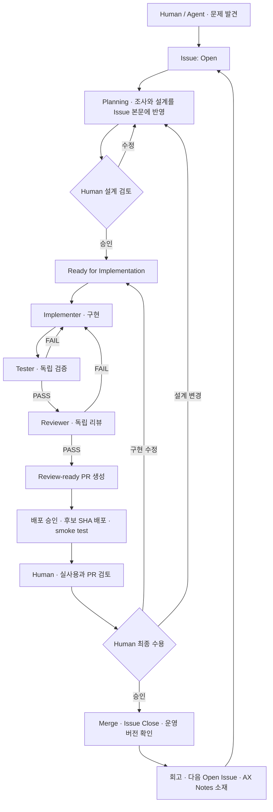

# Agentic Development Workflow

Human이 의도와 품질 기준을 책임지고, Agent가 조사·구현·테스트·리뷰·수정을 수행한다.
Issue는 장기 컨텍스트이자 승인된 설계 계약이고, PR은 그 계약의 구현·검수 기록이다.
제품 판단 기준은 [프로젝트 방향](../project-direction.md), 에이전트 규칙은 [AGENTS.md](../../AGENTS.md)를 따른다.

사용자가 제공한 두 운영안을 통합한다. 첫 운영안의 **Issue 세 상태와 PR 검수**를 유지하고,
추가 운영안의 **배포 → Dogfooding → 최종 수용 → Merge** 순서를 적용한다.
이 문서는 운영 절차이며 백그라운드 에이전트나 자동 배포를 실행하는 프로그램은 아니다.

## 상태와 책임

| Projects Status | 의미 | Agent가 할 수 있는 작업 |
|-----------------|------|-------------------------|
| Open | 아이디어·문제 발견 | 기록·초기 조사 |
| Planning | 요구사항·설계 구체화, Human 승인 대기 | 조사·계획·설계 수정 |
| Ready for Implementation | Issue 본문 설계에 대한 Human 승인 완료 | 구현·테스트·리뷰·승인 범위의 배포 준비 |

GitHub Issue의 open/closed, PR의 open/merged와 별개다. 구현·PR 검토·실사용 중 Issue는 open이며
Projects Status는 Ready for Implementation으로 유지한다. In Progress, In Review, Done은 추가하지 않는다.
작업 진행은 Issue 담당자·연결 PR·검증 기록으로 확인하고, 완료는 Issue closed와 PR merged로 확인한다.
필드가 없거나 상태·승인을 확인하지 못하면 구현을 시작하지 않는다.



## 단계별 운영표

| 단계 | 누가 하는가 | 무엇을 하는가 | 산출물 | 다음 단계 진입 조건 |
|------|-------------|---------------|--------|---------------------|
| 1. Issue 생성 | Human / Agent | 문제·의도·사용자 경험 기록 | Open Issue | 해결할 문제가 기록됨 |
| 2. Planning | Planner + Human 방향 제시 | 코드 조사, UX·설계·범위·구현 순서·AC·테스트·배포 계획 | 설계가 포함된 Issue 본문 | 미결정 질문 없이 구현 가능 |
| 3. 설계 검토 | Human | 의도·복잡성·범위·비용·운영성 검토 | 승인 근거 + Ready Issue | 해당 설계 버전 승인 확인 |
| 4. 구현 | Implementer | 승인 범위 코드·마이그레이션·테스트·문서 | 후보 코드·Unit Tests | AC가 코드에 반영됨 |
| 5. Testing | Tester | AC·오류·경계·회귀·실제 명령 흐름 독립 확인 | Test Report | 현재 SHA의 Tests PASS |
| 6. Agent Review | Reviewer | 설계 일치·보안·오류 처리·자원·복잡성·유지보수 검토 | Review Report | 현재 SHA PASS, Critical/Major 0 |
| 7. PR 생성 | Agent | 계약 구현과 검증 결과 정리 | Review-ready PR | 설계·보고서·Human 검증 절차 포함 |
| 8. 후보 배포 | Agent, Human 배포 판단 | 승인 대상에 고정 SHA 배포, 백업·마이그레이션·health/smoke 확인 | Deployment Report | 정상 동작·롤백 방법 확인 |
| 9. Dogfooding / PR Review | Human, Agent 근거 정리 | 실제 사용·핵심 코드·UX·알림 피로·운영성 검수 | Dogfooding Notes·PR Review | Human이 계속 사용할 수 있다고 판단 |
| 10. Acceptance / Merge | Human 승인, Agent 실행 가능 | 최종 검증 요약, 승인된 코드 병합·Issue 종료·운영 버전 확인 | Merged PR·Closed Issue | 승인 이후 미검토 변경 없음 |
| 11. Retrospective | Human + Agent | 기대·실제 결과·배운 점·다음 방향 정리 | Project Note·다음 Issue·AX Notes 소재 | 다음 개선점이 추적 가능 |

## Issue를 계약으로 만드는 방법

처음에는 [Open 템플릿](../../.github/ISSUE_TEMPLATE/01-open.md)으로 짧게 기록한다.
Planner는 기존 Issue 본문을 [Planning 템플릿](../../.github/ISSUE_TEMPLATE/02-planning.md) 구조로 갱신한다.
새 Planning Issue를 만들었다면 중복 Issue와의 관계를 명확히 한다.

Ready 전 확인 항목:

- Problem·Goal·UX·Requirements·Non-goals가 구체적이다.
- Architecture·Data Model·Interface·Components·Integration Points가 정해졌다. 해당 없는 항목도 이유를 적는다.
- 변경 예상 파일과 구현 순서가 있다. 별도 계획 파일이 있다면 Issue에 요약과 링크를 남긴다.
- AC에 ID를 부여하고 정상·오류·경계·회귀 시나리오와 확인 방법을 연결했다.
- 로그·비용·자원·데이터 보존·배포·롤백·실사용 수용 기준을 정했다.
- Human이 승인한 설계 버전과 승인 근거가 있다. 단순 상태 변경이나 Agent의 요약만으로 승인했다고 판단하지 않는다.

Human은 Issue 댓글에 승인 대상과 조건을 남기고 Status를 Ready로 바꾼다.
예: `현재 Issue 본문의 설계와 AC를 승인합니다. 이 범위로 구현하세요. 운영 배포는 후보 보고 후 별도로 승인합니다.`
직접 채팅 승인은 실제 Human 메시지를 근거로 기록하며, 승인 범위를 확대 해석하지 않는다.

## 개발과 검증 루프

1. Issue·승인·상태를 읽고 기존 PR, 담당자, 작업 브랜치를 확인한다. 중복 작업을 피한다.
2. `codex/issue-<number>-<slug>` 브랜치에서 변경한다. 사용자 수정과 nanobot 서브모듈의 미커밋 변경을 보존한다.
3. Implementer가 필요한 테스트와 코드를 작성하고 관련 검증을 수행한다.
4. Tester와 Reviewer에 Issue, 승인 설계, 기준 커밋, 후보 SHA·diff를 전달한다. 구현자의 결론을 검증 근거로 전달하지 않는다.
5. FAIL은 구현으로 돌아간다. 변경 후 관련 검증과 리뷰를 다시 수행한다. 미실행·환경 장애는 BLOCKED로 보고한다.
6. 현재 SHA에서 Tests PASS와 Agent Review PASS가 확인되면 PR을 생성한다. 아직 배포·실사용을 하지 않았다면 PR에 그 사실과 계획을 적는다.

Python 설치·기본 회귀 명령:

```bash
pip install -e ./nanobot
pip install -e ".[dev]"
python -m pytest tests/msalt/
```

기존 CI는 main 대상 PR과 push에서 Python 3.11/3.12 테스트를 실행한다.
CI는 Projects 상태·Human 승인·Agent Review·실사용 수용을 자동 검증하지 않는다.
실제 검증은 [보고서 템플릿](verification-report-template.md)에 SHA·명령·종료 코드·AC 근거를 기록한다.
단일 컨텍스트 자기 점검만 수행했다면 독립 검증 완료라고 표시하지 않는다.

## 후보 배포와 실사용

배포 대상은 운영자가 선택한 RPi 또는 OCI Linux 호스트다. [배포 가이드](../msalt-rpi-deploy.md)를 참고해
사용자명·저장소 위치·연결 방법을 자신의 환경에 맞게 지정한다. 특정 유지관리자의 서버를 사용할 필요는 없다.
실사용 검수용 후보는 열린 PR의 **고정 커밋 SHA**를 사용한다. main을 먼저 병합해서 검수하지 않는다.
배포 대상, 사용자 영향, 기간, 알림·API 호출 범위는 Issue 계획에 적고 Human의 배포 승인을 확인한다.

배포 전 현재 운영 SHA, 환경 설정, SQLite·워크스페이스 백업과 복원 방법을 확보한다.
실제 서버 주소·개인 경로·설정 내용은 운영자별 비공개 기록으로 관리하며 공개 저장소의 기준값으로 고정하지 않는다.
SQLite 백업은 쓰기 중인 파일의 단순 복사 대신 일관된 백업 방식 또는 쓰기 중단 절차를 사용한다.
별도 검증 인스턴스라면 운영 봇 토큰·사용자 DB를 공유하지 않으며 중복 알림을 방지한다.
운영 인스턴스를 쓴다면 서비스 중단·마이그레이션 영향과 복구 절차를 승인 범위에 포함한다.

배포 후 기록할 항목:

- 후보 SHA·대상 플랫폼(RPi/OCI)·시각·배포 승인 근거·이전 운영 SHA. 공개 보고서는 개인 서버 식별 정보를 제외한다.
- 서비스 active 여부, Telegram 응답, 해당 기능과 기존 뉴스·기록 기능의 smoke 결과.
- 마이그레이션·데이터 확인·로그 오류·롤백 절차. 위험한 데이터 변경은 코드 롤백과 별도로 설명한다.
- 실제 실행한 명령과 결과. 자동 메시지 발송·비용이 드는 검증은 승인된 범위에서 수행한다.

Dogfooding 기간은 기능에 맞춰 Issue에서 정한다. 매일 알림 기능은 예약 시각을 포함하고,
주간 기능은 집계 주기를 포함한다. 몇 일 또는 몇 주라는 고정 기간을 모든 변경에 강제하지 않는다.
Human은 유용성·불편·알림 피로·오류·계속 사용할지와 수용 여부를 PR에 남긴다.
문서만 바꾸는 등 배포·실사용이 적용되지 않는 변경은 Human이 N/A 근거를 수용한 뒤 병합한다.

## Human Review 수정과 완료

- **구현 문제**: Ready 유지, 기존 PR에서 수정 → Testing → Agent Review → 필요 시 후보 재배포·실사용 → Human Review.
- **설계 문제**: Planning으로 이동, Issue 설계·AC 수정 → Human 재승인 → Ready. Agent가 새 설계를 임의 구현하지 않는다.
- **승인**: Human PR 검토·실사용 수용·명시적 Merge 승인 확인. 승인 SHA 이후 변경이 있으면 다시 검토한다.
- **Merge**: PR의 `Closes #<number>`로 Issue 종료를 연결하고 실제 종료를 확인한다. Projects Status를 Done으로 바꾸지 않는다.
- **운영 확인**: squash/rebase에 따른 새 SHA와 후보 코드의 일치를 확인하고, 승인 범위에 맞게 최종 main 배포·smoke 결과를 남긴다.
- **회고**: 기대·실제 결과·결정·후속 Issue를 기록한다. 새 사용 문제는 새 Open Issue로 관리한다.

GitHub에서는 PR 작성자가 자신의 PR을 Approve할 수 없다. Human과 Agent가 같은 계정을 쓰는 개인 운영에서는
별도 Human 리뷰 댓글·직접 승인 기록과 명시적 병합 승인을 남긴다. 이를 GitHub의 required approving review가 충족된 것으로 표시하지 않는다.
GitHub 기능 차원의 강제를 원하면 별도 검토자 계정과 저장소 보호 설정을 사용한다.

## 시작하기와 설정 범위

[역할별 프롬프트](agent-prompts.md)를 복사해 Issue 번호와 SHA를 지정하면 단계별로 작업을 시작할 수 있다.
[GitHub Projects 설정](github-project-setup.md)으로 세 상태 보드를 연결한다.
템플릿은 기본 브랜치에 반영한 뒤 GitHub에서 사용된다. 문서·AGENTS는 운영 규칙이며 GitHub 서버 측 강제 장치는 아니다.
이번 준비에 예약 Agent 실행, 자동 Merge, 자동 운영 배포는 포함하지 않는다.

GitHub 동작 참고:

- [Issue / PR 템플릿](https://docs.github.com/en/communities/using-templates-to-encourage-useful-issues-and-pull-requests)
- [Projects 기본 자동화](https://docs.github.com/en/issues/planning-and-tracking-with-projects/automating-your-project/using-the-built-in-automations)
- [PR 리뷰와 본인 PR 승인 제한](https://docs.github.com/en/pull-requests/how-tos/review-pull-requests/reviewing-proposed-changes-in-a-pull-request)
