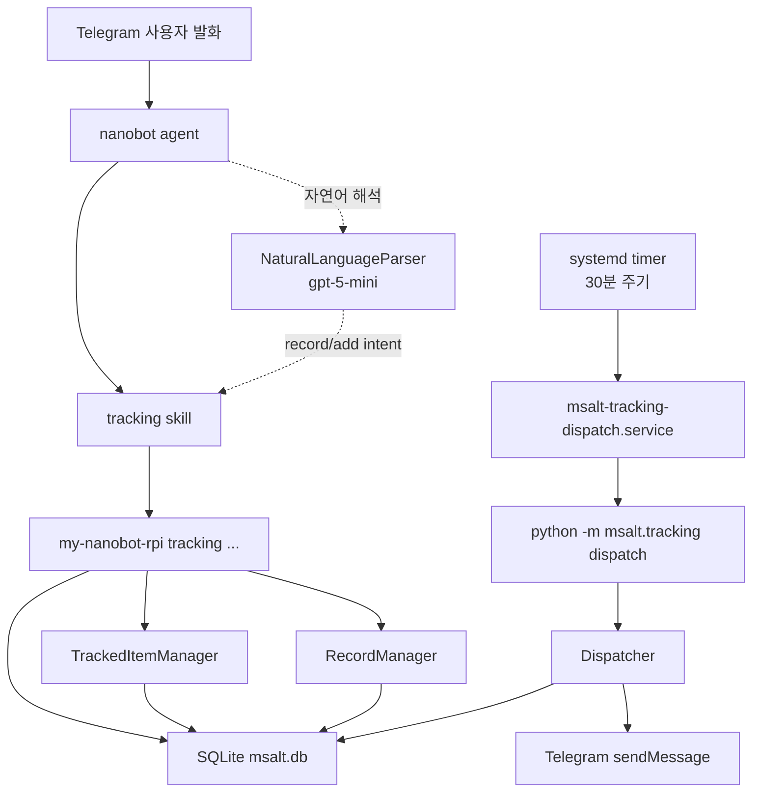

# Lifestyle Tracking Pipeline

이 문서는 my-nanobot-rpi의 생활 습관 기록 기능이 어떻게 동작하는지 정리한다. 사용자가 텔레그램에서 자연어로 기록하거나, 봇이 정해진 시간에 먼저 물어보거나, CLI로 직접 기록할 때 어떤 코드와 테이블을 거치는지 한 곳에서 볼 수 있게 한다.

## 전체 흐름



생활 기록 시스템은 크게 세 경로로 움직인다.

1. 사용자가 직접 말한다: "어제 7시간 잤어", "맥주 1캔", "영어공부 했어"
2. 봇이 먼저 묻는다: 정해진 시각 또는 retry 슬롯에서 텔레그램 알림
3. 운영자가 CLI로 직접 조작한다: add/list/delete/record/summary/dispatch

진실의 단일 출처는 `~/.nanobot/workspace/msalt.db`다. 스킬 문서에서도 파일에 직접 기록하지 말고 반드시 CLI를 호출하도록 강하게 제한한다.

## 주요 파일

| 파일 | 역할 |
| --- | --- |
| `msalt/tracking/items.py` | 추적 항목 CRUD, schema 검증, 기본 seed |
| `msalt/tracking/records.py` | 기록 upsert, 조회, schema별 통계와 기록 후 조언 |
| `msalt/tracking/parser.py` | LLM 기반 자연어 기록/항목 추가 의도 파싱 |
| `msalt/tracking/dispatcher.py` | 정해진 시각 알림, pending/retry 처리, batch 메시지 생성 |
| `msalt/tracking/cli.py` | `dispatch`, `add`, `list`, `delete`, `record`, `summary` CLI |
| `msalt/tracking/alcohol.py` | 술 종류별 표준 용량/도수와 순알코올 g 계산 기준 |
| `msalt/storage.py` | `tracked_items`, `records` 테이블과 관련 DB 메서드 |
| `msalt/skills/tracking/SKILL.md` | agent가 생활 기록 요청을 처리하는 규칙 |
| `deploy/msalt-tracking-dispatch.service` | dispatcher one-shot systemd service |
| `deploy/msalt-tracking-dispatch.timer` | dispatcher 30분 주기 systemd timer |
| `deploy/setup-rpi.sh` | timer/service 설치와 venv PATH 설정 |

## 데이터 모델

SQLite DB 기본 경로는 `~/.nanobot/workspace/msalt.db`다.

### `tracked_items`

사용자가 추적하는 항목 정의 테이블.

| 컬럼 | 설명 |
| --- | --- |
| `id` | 자동 증가 ID |
| `name` | 항목명, UNIQUE. 예: `수면`, `음주`, `영어공부` |
| `schema` | `freetext`, `duration`, `quantity`, `boolean` |
| `unit` | quantity 항목 단위. 예: `g`, `잔`, `회` |
| `schedule_time` | 매일 질문할 기준 시각, KST `HH:MM` |
| `frequency` | 현재 기본값 `daily` |
| `created_at` | SQLite UTC 생성 시각 |
| `last_missed_asked_date` | 과거 누락 질문용 legacy 컬럼 |
| `pending_since` | 첫 알림 발송 후 아직 답이 없는 상태의 UTC 시각 |
| `pending_recorded_for` | pending 알림이 요구한 대상 기록 날짜, `YYYY-MM-DD` |
| `last_asked_at` | 마지막 알림 발송 UTC 시각. 같은 retry 슬롯 중복 발송 방지 |

### `records`

항목별 실제 기록 테이블.

| 컬럼 | 설명 |
| --- | --- |
| `id` | 자동 증가 ID |
| `item_id` | `tracked_items.id` |
| `recorded_for` | 사용자 기준 날짜, `YYYY-MM-DD` |
| `recorded_at` | 시스템 기록 시각, SQLite UTC |
| `value_text` | freetext 값 |
| `value_num` | duration 분, quantity 수치 |
| `value_bool` | boolean 값, 0/1 |
| `value_json` | 구조화된 부가 정보. 주로 음주 세부값 |
| `raw_input` | 사용자의 원문 |

`UNIQUE(item_id, recorded_for)` 제약이 있다. 같은 항목/날짜를 다시 기록하면 새 row가 추가되지 않고 기존 기록을 덮어쓴다.

## 추적 항목 schema

| schema | 의미 | 저장 필드 | 예 |
| --- | --- | --- | --- |
| `duration` | 시간 길이 | `value_num` 분 단위 | 수면 480분, 독서 30분 |
| `quantity` | 양/횟수 | `value_num`, `unit` | 음주 19.7g, 물 5잔 |
| `boolean` | 했음/안함 | `value_bool` | 영어공부 함/안함 |
| `freetext` | 자유 메모 | `value_text` | 컨디션 메모 |

`TrackedItemManager._validate()`는 다음을 강제한다.

- `name`은 비어 있으면 안 된다.
- `schema`는 네 가지 중 하나여야 한다.
- `schedule_time`은 `HH:MM` 형식이어야 한다.
- `quantity`는 `unit`이 필수다.
- `quantity`가 아닌 schema에는 `unit`을 둘 수 없다.

## 기본 seed 항목

빈 DB에서 tracking CLI가 처음 실행되면 `TrackedItemManager.seed_defaults()`가 기본 항목을 넣는다.

| 항목 | schema | unit | schedule_time |
| --- | --- | --- | --- |
| `수면` | `duration` | 없음 | `08:00` |
| `음주` | `quantity` | `g` | `22:00` |
| `영어공부` | `boolean` | 없음 | `22:00` |

DB에 항목이 하나라도 있으면 seed는 다시 실행되지 않는다. 사용자가 기본 항목을 삭제한 뒤 `list`를 다시 실행해도 삭제한 항목이 되살아나지 않는다.

## CLI 명령

`my-nanobot-rpi`의 tracking subcommand는 `msalt.tracking.cli.run_command()`로 전달된다.

```bash
my-nanobot-rpi tracking list
my-nanobot-rpi tracking add <이름> <schema> --time HH:MM [--unit 단위]
my-nanobot-rpi tracking delete <이름>
my-nanobot-rpi tracking record <이름> --date YYYY-MM-DD [--text TEXT] [--num N] [--bool|--no-bool] [--json JSON] --raw "원문"
my-nanobot-rpi tracking summary <이름> --days 7 --ref YYYY-MM-DD
my-nanobot-rpi tracking dispatch
```

중요: agent와 스킬에서는 `python -m msalt.tracking ...`를 쓰지 않는다. nanobot exec 환경에서 venv 밖 Python으로 풀리면 `ModuleNotFoundError`가 날 수 있기 때문이다. 사용자가 직접 systemd service를 돌리는 경우에는 service의 `PATH`가 venv를 가리키므로 `python -m msalt.tracking dispatch`도 동작한다.

## 직접 기록 흐름

예: 사용자가 "어제 7시간 잤어"라고 말한다.

1. nanobot agent가 `tracking` 스킬을 사용한다.
2. agent가 현재 추적 항목 목록과 사용자 발화를 보고 항목, 날짜, 값을 추론한다.
3. 필요한 경우 LLM parser가 `ParsedRecord`를 만든다.
4. agent가 CLI를 호출한다.

```bash
my-nanobot-rpi tracking record 수면 --date 2026-05-22 --num 420 --raw "어제 7시간 잤어"
```

5. `RecordManager.upsert()`가 항목명을 `tracked_items`에서 찾는다.
6. `Storage.upsert_record()`가 `records`에 insert 또는 update한다.
7. CLI가 "기록되었어"와 `RecordManager.advice_after_record()`의 짧은 패턴 코멘트를 출력한다.
8. agent는 CLI 출력을 사용자에게 전달한다.

boolean 항목의 부정 답은 반드시 `--no-bool`로 기록한다.

```bash
my-nanobot-rpi tracking record 영어공부 --date 2026-05-22 --no-bool --raw "오늘 영어공부 안 했어"
```

## 자연어 parser

`NaturalLanguageParser`는 OpenAI chat completions client와 model명을 받아 동작한다. 현재 prompt는 두 작업을 처리한다.

### 기록 파싱

`parse_record(text, known_items, now)`는 다음 JSON 형태를 요구한다.

```json
{
  "item_name": "수면",
  "recorded_for": "2026-05-22",
  "value_text": null,
  "value_num": 420,
  "value_bool": null,
  "value_json": null,
  "confidence": 0.9
}
```

규칙:

- "어제", "지난주 화요일" 같은 상대 날짜는 `now` 기준 절대 날짜로 바꾼다.
- duration은 분 단위 `value_num`으로 저장한다.
- quantity는 item의 unit을 사용한다.
- boolean은 `value_bool`을 사용한다.
- freetext는 `value_text`를 사용한다.
- 매칭이 없거나 모호하면 `item_name=null`, `confidence=0`으로 반환한다.
- JSON 파싱에 실패해도 예외를 밖으로 던지지 않고 confidence 0 결과로 fallback한다.

### 항목 추가 의도 파싱

`parse_item_intent(text)`는 새 항목의 이름, schema, unit, schedule_time을 추론한다.

예:

```json
{
  "name": "독서",
  "schema": "duration",
  "unit": null,
  "schedule_time": "22:00"
}
```

스킬 규칙상 항목 추가는 바로 실행하지 않고, 사용자에게 추론 결과를 확인받은 뒤 `tracking add`를 호출해야 한다.

## 음주 기록

음주 항목은 `quantity` schema이고 기본 단위는 순알코올 `g`이다.

`msalt/tracking/alcohol.py`는 기본 술 프로필을 제공한다.

| 술 | 기본 단위 | 용량 | 도수 |
| --- | --- | --- | --- |
| 소주 | 병 | 360ml | 17% |
| 맥주 | 캔 | 500ml | 5% |
| 막걸리 | 병 | 750ml | 6% |
| 와인 | 잔 | 150ml | 13% |
| 위스키 | 잔 | 45ml | 40% |
| 하이볼 | 잔 | 350ml | 7% |
| 칵테일 | 잔 | 150ml | 15% |

계산식:

```text
alcohol_g = amount * serving_ml * (abv_percent / 100) * 0.789
```

음주 parser는 가능한 경우 `value_json`에 세부 정보를 넣는다.

```json
{
  "drink_type": "맥주",
  "amount": 1,
  "unit": "캔",
  "serving_ml": 500,
  "abv_percent": 5,
  "alcohol_g": 19.7
}
```

기록 요약은 이 JSON을 읽어 최근 음주 상세를 함께 보여준다.

## 통계와 조언

`RecordManager.summarize()`는 schema별로 다르게 요약한다.

| schema | 요약 |
| --- | --- |
| `duration` | 최근 N일 기록 횟수, 평균 시간, 총 시간 |
| `quantity` | 최근 N일 기록 횟수, 합계, 평균 |
| `boolean` | 수행 횟수 / 기록 횟수, 수행률 |
| `freetext` | 최근 기록 최대 5건 나열 |

`RecordManager.advice_after_record()`는 기록 직후 짧은 코멘트를 만든다.

현재 포함된 휴리스틱:

- 음주가 최근 7일 3일 이상 또는 최근 30일 8일 이상이면 줄이는 방향 제안
- 음주 0g 기록이면 긍정적 코멘트
- boolean 항목이 최근 7일 0회면 재시작 제안
- 수면 평균이 7시간 미만이면 수면 확보 제안
- 수면 평균이 7~9시간이면 유지 제안

이 조언은 진단이나 의료 조언이 아니라 기록 기반의 짧은 생활 패턴 코멘트다.

## 능동 알림 dispatcher

`Dispatcher.run(now)`는 30분 단위로 실행되는 one-shot 로직이다.

상수:

| 상수 | 값 | 의미 |
| --- | --- | --- |
| `KST` | `Asia/Seoul` | 사용자 기준 시간대 |
| `WINDOW_MINUTES` | 30 | 이번 tick에서 볼 시간창 |
| `RECENT_HOURS` | 24 | 첫 알림 전 최근 기록 검사 범위 |
| `GLOBAL_RETRY_SLOTS` | `09:00`, `14:00`, `20:00` | 답이 없을 때 재질문 시각 |

### 첫 알림

각 항목의 `schedule_time`이 `(now - 30분, now]` 안에 들어오면 첫 알림 후보가 된다. 단, 최근 24시간 안에 해당 항목 기록이 있으면 알림을 보내지 않는다.

첫 알림을 보내면 메시지와 reply keyboard에 대상 날짜를 함께 넣는다.

```text
⏰ '수면' 기록할 시간이야. 대상 날짜: 2026-05-22. 얼마나 했는지 알려줘.
```

첫 알림을 보낸 뒤에는:

- `pending_since`를 현재 UTC 시각으로 설정
- `pending_recorded_for`를 알림 대상 날짜로 설정
- `last_asked_at`을 현재 UTC 시각으로 설정

### pending 해제

다음 tick에서 `pending_recorded_for` 날짜의 기록이 들어온 것이 확인되면 pending을 지운다.

```text
storage.record_exists(item_id, pending_recorded_for) == True
```

예를 들어 2026-05-22 수면 기록을 물어봤는데 사용자가 실수로 2026-05-23 수면만 기록하면 pending은 유지된다. 이렇게 해야 다음 retry에서 어떤 날짜 기록이 빠졌는지 계속 명확하게 물을 수 있다.

기존 DB처럼 `pending_recorded_for`가 비어 있는 오래된 pending은 호환을 위해 `pending_since` 이후 기록 여부로 fallback한다.

### retry

답이 없으면 다음날 또는 이후 `09:00`, `14:00`, `20:00` KST retry 슬롯에서 다시 묻는다. `last_asked_at`으로 같은 retry 슬롯 안에서 두 번 보내는 것을 막는다.
retry 문구도 기존 pending의 `pending_recorded_for`를 사용한다.

```text
⏰ '수면' 2026-05-22 기록이 아직 비어 있어. 얼마나 했는지 알려줘.
```

### stale pending

다음 schedule slot이 도래하면 이전 pending은 stale로 보고 지운 뒤 새 첫 알림을 보낼 수 있다. 예를 들어 어제 22:00 수면 질문에 답이 없어도 오늘 22:00이 되면 어제 pending은 폐기된다.

### batch 메시지

같은 tick에 여러 항목이 알림 대상이면 한 텔레그램 메시지로 묶는다.

```text
📝 기록할 항목 3개:
1. 수면 (2026-05-22 기록) — 몇 시간/얼마나?
2. 음주 (2026-05-22 기록) — 무슨 술, 얼마나?
3. 영어공부 (2026-05-22 기록) — 했어?
```

단일 항목이면 기존처럼 자연스러운 한 문장으로 보낸다.

reply keyboard 버튼에도 항목명과 대상 날짜가 들어간다.

```text
수면 2026-05-22 7시간
음주 2026-05-22 안 마심
영어공부 2026-05-22 했어
```

agent는 버튼 텍스트의 날짜를 `tracking record --date`에 그대로 사용한다. 현재 날짜와 다르더라도 버튼에 있는 날짜가 우선이다.

## systemd timer

배포 스크립트는 두 유닛을 설치한다.

### `deploy/msalt-tracking-dispatch.timer`

```ini
[Timer]
OnCalendar=*:00,30
Persistent=true
Unit=msalt-tracking-dispatch.service
```

매시 00분과 30분에 dispatcher service를 실행한다.

### `deploy/msalt-tracking-dispatch.service`

```ini
ExecStart=/home/pi/my-nanobot-rpi/.venv/bin/python -m msalt.tracking dispatch
```

`deploy/setup-rpi.sh`가 실제 repo 경로와 사용자에 맞게 `/home/pi/my-nanobot-rpi`를 치환한다. 현재 rpi가 `/home/ubuntu/my-nanobot-rpi`에 있다면 설치된 unit도 그 경로를 사용한다.

확인 명령:

```bash
sudo systemctl status msalt-tracking-dispatch.timer
systemctl list-timers msalt-tracking-dispatch.timer
journalctl -u msalt-tracking-dispatch.service -n 50
sudo systemctl start msalt-tracking-dispatch.service
```

## tracking skill 규칙

`msalt/skills/tracking/SKILL.md`는 `always: true`로 설정되어 있다. 생활 기록 의도가 보이면 agent가 항상 참고할 수 있다.

핵심 규칙:

- 기록 의도는 반드시 `my-nanobot-rpi tracking record ...` CLI로 저장한다.
- `~/.nanobot/workspace`에 직접 파일을 만들지 않는다.
- CLI 실패 시 에러 원문과 실행 명령을 사용자에게 보여주고 멈춘다.
- `python -m msalt.tracking ...`는 agent 경로에서 금지한다.
- 항목 추가는 schema/time 추론 후 사용자 확인을 받고 실행한다.
- batch 알림에 한 번에 답하면 항목별로 record CLI를 각각 호출한다.
- 알림이나 버튼에 `YYYY-MM-DD`가 있으면 해당 날짜를 각 항목의 `--date`로 사용한다.
- boolean 부정 답은 `--no-bool`로 저장한다.

## 운영 명령

### 항목 목록

```bash
my-nanobot-rpi tracking list
```

### 항목 추가

```bash
my-nanobot-rpi tracking add 독서 duration --time 22:00
my-nanobot-rpi tracking add 물 quantity --unit 잔 --time 21:00
my-nanobot-rpi tracking add 스트레칭 boolean --time 22:00
my-nanobot-rpi tracking add 컨디션 freetext --time 21:30
```

### 기록

```bash
my-nanobot-rpi tracking record 수면 --date 2026-05-22 --num 420 --raw "7시간 잤어"
my-nanobot-rpi tracking record 음주 --date 2026-05-22 --num 19.7 --json '{"drink_type":"맥주","amount":1,"unit":"캔","serving_ml":500,"abv_percent":5,"alcohol_g":19.7}' --raw "맥주 1캔"
my-nanobot-rpi tracking record 영어공부 --date 2026-05-22 --bool --raw "영어공부 했어"
my-nanobot-rpi tracking record 영어공부 --date 2026-05-22 --no-bool --raw "영어공부 안 했어"
my-nanobot-rpi tracking record 컨디션 --date 2026-05-22 --text "피곤하지만 집중은 괜찮음" --raw "오늘 컨디션 피곤하지만 집중은 괜찮아"
```

### 요약

```bash
my-nanobot-rpi tracking summary 수면 --days 7
my-nanobot-rpi tracking summary 음주 --days 30 --ref 2026-05-22
```

### dispatcher 수동 실행

```bash
my-nanobot-rpi tracking dispatch
my-nanobot-rpi tracking dispatch --now 2026-05-23T22:05:00+09:00
```

## 장애 대응

### 봇이 "기록 완료"라고 했는데 DB에 없음

정상 동작이라면 절대 없어야 한다. 스킬 규칙상 CLI 성공 없이 완료 응답을 하면 안 된다.

확인:

1. 사용자가 받은 응답에 CLI stderr가 있었는지 확인
2. `journalctl -u my-nanobot-rpi -n 100` 확인
3. `my-nanobot-rpi tracking list`로 항목 존재 확인
4. `my-nanobot-rpi tracking summary <항목명> --days 7` 확인

### `my-nanobot-rpi tracking ... command not found`

nanobot exec 도구의 PATH에 venv bin이 빠졌을 때 발생한다. `deploy/setup-rpi.sh`는 `~/.nanobot/config.json`의 `tools.exec.path_append`에 venv bin을 넣는다.

수동 패치:

```bash
.venv/bin/python - <<'PY'
import json
from pathlib import Path
cfg = Path.home() / ".nanobot" / "config.json"
data = json.loads(cfg.read_text(encoding="utf-8"))
data.setdefault("tools", {}).setdefault("exec", {})["path_append"] = str(Path.cwd() / ".venv" / "bin")
cfg.write_text(json.dumps(data, indent=2, ensure_ascii=False), encoding="utf-8")
PY
sudo systemctl restart my-nanobot-rpi
```

### 알림이 오지 않음

확인:

```bash
sudo systemctl status msalt-tracking-dispatch.timer
systemctl list-timers msalt-tracking-dispatch.timer
journalctl -u msalt-tracking-dispatch.service -n 50
```

점검 포인트:

- timer가 enabled/active인지
- `.env`의 `TELEGRAM_BOT_TOKEN`, `TELEGRAM_USER_ID`가 systemd service에 로드되는지
- 항목의 `schedule_time`이 현재 30분 window에 들어오는지
- 최근 24시간 기록이 있어서 첫 알림이 skip된 것은 아닌지
- `pending_since`, `pending_recorded_for`, `last_asked_at`이 retry를 막고 있는 것은 아닌지

### 같은 retry가 반복됨

`last_asked_at`이 업데이트되지 않으면 같은 retry 슬롯에서 반복될 수 있다. 현재 Dispatcher는 batch 발송 후 모든 batch item의 `last_asked_at`을 현재 UTC로 갱신한다.

확인할 DB 컬럼:

```sql
SELECT name, pending_since, last_asked_at FROM tracked_items;
```

대상 날짜까지 같이 확인하려면:

```sql
SELECT name, pending_since, pending_recorded_for, last_asked_at FROM tracked_items;
```

### 항목 추가가 잘못됨

항목 추가는 LLM 추론 후 사용자 확인을 받아야 한다. 잘못 들어간 경우:

```bash
my-nanobot-rpi tracking delete <이름>
my-nanobot-rpi tracking add <이름> <schema> --time HH:MM [--unit 단위]
```

주의: 항목 삭제는 `records`도 cascade 삭제한다.

## 테스트

관련 테스트:

```bash
python -m pytest tests/msalt/tracking tests/msalt/test_storage.py tests/msalt/test_cli.py
python -m ruff check msalt/tracking msalt/storage.py msalt/cli.py tests/msalt/tracking tests/msalt/test_storage.py tests/msalt/test_cli.py
```

주요 테스트 범위:

- 항목 validation, seed, CRUD
- 기록 upsert와 같은 날짜 overwrite
- schema별 summary
- 음주 `value_json`과 순알코올 g 처리
- LLM parser JSON 파싱 성공/실패
- 항목 추가 의도 파싱
- dispatcher 첫 알림, retry, stale pending, batch 메시지
- CLI add/list/delete/record/summary/dispatch
- rpi 배포 스크립트의 timer/service 경로 치환은 수동 운영 확인 대상

## 현재 한계와 개선 후보

- 자연어 parser는 LLM 출력 품질에 의존한다.
- CLI에는 자연어를 직접 넣는 `parse-and-record` 명령이 없다. 현재는 agent가 자연어를 해석해 `record` 인자를 구성한다.
- `frequency` 컬럼은 있지만 현재 dispatcher는 daily 중심으로 동작한다.
- 항목 삭제 시 과거 기록도 같이 삭제된다. 보관이 필요하면 archive 방식이 필요하다.
- `last_missed_asked_date`는 legacy 성격이고 현재 핵심 retry 로직은 `pending_since`, `last_asked_at` 중심이다.
- dispatcher는 Telegram 직접 발송만 한다. 다른 채널로 확장하려면 sender abstraction을 넓혀야 한다.
- 음주 계산은 기본 프로필 기반이다. 사용자가 다른 용량/도수를 말하면 parser가 JSON에 반영해야 한다.

다음 개선 후보:

- CLI에 자연어 입력 명령 추가: `tracking parse-record "어제 7시간 잤어"`
- weekly/monthly tracking report 자동 생성
- 항목별 frequency 지원: weekday, weekly, custom days
- 기록 삭제/수정 CLI
- archive 기반 항목 삭제
- dispatcher dry-run 명령
- Telegram inline button으로 boolean 답변 처리
