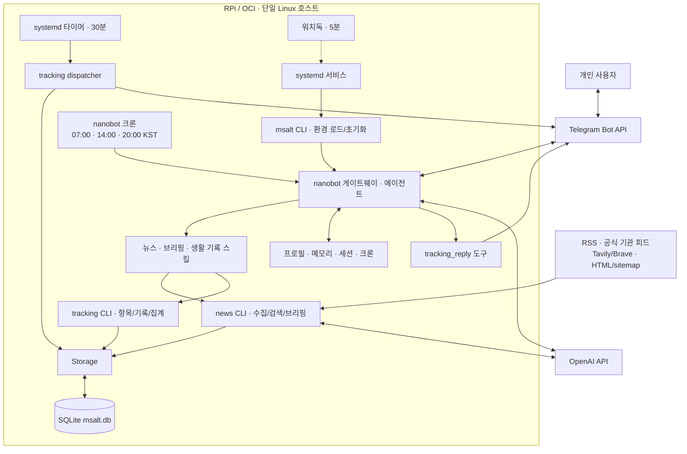

# my-nanobot-rpi TRD

최종 갱신: 2026-10-05.
[PRD](msalt-prd.md)의 현재 기능을 코드 기반으로 설명하고 공개 배포의 기술 기준·확장 검토 사항을 정의한다.
Watch·Review의 명령·테이블·주기는 미구현 제안이며 상세 Issue 승인으로 확정한다.
실제 운영 서버의 주소·경로·상태·배포 SHA는 운영자별 비공개 기록으로 관리한다.

## 1. 시스템과 배포 경계

RPi 또는 OCI Cloud Instance의 단일 Linux 호스트에서 nanobot 게이트웨이와 msalt를 실행한다.
nanobot은 Git 서브모듈이며 에이전트·채널·도구·스킬·크론·메모리·dream을 제공한다.
msalt는 초기화·뉴스·생활 기록/통계·알림과 nanobot 확장 도구를 제공한다.
Telegram·OpenAI·뉴스 피드·검색 API는 외부 서비스다.



그림은 현재 구현 구조다. Watch·정기 Review는 포함되지 않는다.

## 2. 컴포넌트 책임

| 코드 | 책임 |
|------|------|
| msalt/cli.py | .env·필수 값 점검, 기본 설정 생성, 스킬·크론 동기화, gateway/doctor/news/tracking |
| config.py | 기본 DB·소스 경로·시간대. 세 브리핑 예약은 cron/jobs.json 기준 |
| storage.py | 테이블·호환 마이그레이션·조회·upsert·pending/이력 갱신 |
| news/collector.py | RSS·공식·검색·보완 수집 결합, 경로별 실패 격리, URL dedup |
| news/briefing.py | 발행 기간·기존 브리핑 제외, 카테고리 요약·링크·생성 이력 |
| tracking/items.py, records.py | 항목 검증·기본 생성, 기록·집계·7일/30일 코멘트·누락 조회 |
| tracking/parser.py | 자연어 기록·항목 의도 파서 모듈. 현재 스킬은 에이전트가 값을 결정해 CLI에 전달 |
| tracking/alcohol.py | 술 프로필·용량·도수·순알코올 환산 |
| tracking/dispatcher.py | 예약·pending 재알림·묶음 메시지·키보드 |
| tracking/reply_tool.py | nanobot tool entry point, 저장 후 최종 응답·키보드 전송 |
| runtime_migration.py | 특정 과거 프로필 기록 백업·아카이브, 기존 기본 context 예산 정비 |
| responses_compat.py | upstream Responses replay 필드 alias 호환 처리 |

스킬은 자연어 의도를 CLI/도구로 연결하고 Python 코드가 저장·집계한다.
설치된 `my-nanobot-rpi`를 실행하며 서비스·스킬에서 임의 시스템 Python으로 venv를 우회하지 않는다.
nanobot 갱신 시 도구 entry point와 호환 처리가 사용하는 upstream 내부 API를 함께 검증한다.

## 3. 현재 처리 흐름

### 뉴스

1. nanobot 크론/사용자 요청 → news/news-briefing 스킬 → 뉴스 CLI.
2. Storage 초기화와 수집. briefing 명령 자체도 수집한다.
3. RSS·공식·검색·HTML/sitemap 결과를 정규화해 URL 기준 저장.
4. 발행 시각·브리핑 이력으로 선택 후 국내/해외/정책 요약·근거 링크 출력.
5. 에이전트/크론 채널에서 Telegram 전달.

news_briefed_articles는 생성 시 갱신되며 수신 완료와 원자적으로 연결된 전달 이력이 아니다.
발송 실패 뒤 누락·재전송 정책은 [로드맵 단계 1](implementation-roadmap.md)에서 보완한다.
검색은 저장 기사 전체의 제목·요약을 비교하므로 기간·개수 제한은 추가 설계 대상이다.

### 기록과 후속 응답

1. 에이전트가 tracking 스킬과 입력/직전 질문으로 항목·대상 날짜·값 결정.
2. record CLI가 날짜별 upsert. 음주는 순알코올 g과 구조화 JSON 저장.
3. 저장 결과·7일/30일 코멘트·FOLLOW_UP_JSON 출력.
4. 성공 후 tracking_reply로 응답·후속 질문·키보드 전송. 누락이 없으면 키보드 제거.

CLI에 parse-record 명령은 없다. 파서 모듈이 있다고 모든 Telegram 입력이 그 모듈로 처리되는 것은 아니다.
묶음 답변은 항목별 record 호출이며 여러 항목 저장 전체가 하나의 원자적 트랜잭션은 아니다.

### 예약과 재알림

systemd 타이머가 매시 00/30분 dispatcher를 호출한다.
KST 30분 윈도우와 기록·pending을 읽어 예약 질문 또는 09:00·14:00·20:00 재알림을 구성한다.
pending 대상 날짜·마지막 질문 시각으로 후속 처리를 제한하고 여러 대상을 한 메시지로 보낸다.
응답·다음 예약 슬롯에 따른 pending 정리, 발송·저장 순서와 재시작 경계는 독립 테스트 대상이다.

## 4. 현재 데이터 모델

SQLite 테이블은 **네 개**다. 상세 컬럼·마이그레이션은 [Storage 코드](../msalt/storage.py)를 기준으로 한다.

| 테이블 | 주요 필드 | 제약·의미 |
|--------|-----------|-----------|
| news_articles | id, source, title, url, summary, category, collected_at, published_at | url UNIQUE, domestic/international/policy, 수집·발행 시각 구분 |
| news_briefed_articles | article_url, briefing_label, briefed_at | article_url PK, 브리핑 생성 이력 |
| tracked_items | id, name, schema, unit, schedule_time, frequency, created_at | name UNIQUE, 현재 기본 frequency daily |
| tracked_items 알림 상태 | last_missed_asked_date, pending_since, pending_recorded_for, last_asked_at | 과거 호환 필드·pending·대상 날짜·질문 시각 |
| records | id, item_id, recorded_for, recorded_at, value_text, value_num, value_bool, value_json, raw_input | UNIQUE(item_id, recorded_for), item FK ON DELETE CASCADE |

- duration은 분, quantity는 항목 unit 단위이며 음주 기본 unit은 g다.
- value_json은 TEXT 직렬화 데이터, raw_input은 원문이다.
- recorded_for는 사용자 대상 날짜, recorded_at은 저장 시각이다. 같은 항목·날짜는 갱신한다.
- `_connect()`에서 foreign_keys를 켜며 항목 삭제는 관련 기록 삭제로 연결된다.
- 뉴스 발행 시각은 UTC 정규화, 예약·대상 날짜는 KST 기준이다. 시스템 시각 기반 출력·기본값도 있어 환경 시간대와 경계를 검증한다.
- boolean 통계는 저장된 기록 수가 분모다. 누락 날짜를 미수행으로 간주하지 않는다.

initialize()는 CREATE IF NOT EXISTS와 기존 컬럼 확인 후 ALTER ADD를 적용한다.
새 마이그레이션은 데이터 보존·재실행·구버전 호환/복원 가능성을 검증한다. 단순 코드 checkout을 DB 롤백으로 가정하지 않는다.

## 5. 인터페이스와 설정

| 진입점 | 현재 인터페이스 |
|--------|-----------------|
| 기동 | my-nanobot-rpi 또는 gateway |
| 진단 | doctor |
| 뉴스 | news collect, news briefing morning/afternoon/evening, news search 키워드 |
| 항목 | tracking add/list/delete |
| 기록·집계 | tracking record, tracking summary 이름 --days N, tracking dispatch |
| 확장 도구 | tracking_reply, pyproject.toml의 nanobot.tools entry point |

record는 --date/--raw와 --text/--num/--bool/--no-bool/--json으로 명시적인 값을 전달한다.
FOLLOW_UP_JSON은 내부 제어 정보이며 사용자에게 그대로 표시하지 않는다.

| 설정 | 역할 |
|------|------|
| 프로젝트 .env | 필수 OpenAI/Telegram 값, 선택 Tavily/Brave 키 |
| nanobot-config.example.json | 대화 모델·provider·workspace·채널·도구 템플릿 |
| ~/.nanobot/config.json | 실행 사용자 설정·환경 변수 치환 |
| news/sources.json | 일반 RSS 7·공식 피드 3·검색 4·보완 4개의 현재 설정 |
| workspace/cron/jobs.json | 하루 세 브리핑 크론 템플릿 |

대화 모델은 nanobot 설정, 뉴스 요약 기본 모델은 briefing.py로 각각 정한다.
Responses와 Chat Completions 경로를 구분해 모델·SDK 호환을 검증한다.
현재 msalt 기본 DB는 실행 사용자의 ~/.nanobot/workspace/msalt.db다.
nanobot workspace 변경만으로 모든 msalt CLI DB 경로가 자동 변경된다고 가정하지 않는다.
임의 경로 지원을 확대한다면 gateway·스킬·CLI·timer가 동일 설정을 쓰도록 별도 설계한다.

## 6. RPi/OCI 공통 배포와 운영

프로젝트 패키지는 Python 3.11+를 선언하고 nanobot 서브모듈을 별도로 설치한다.
실제 호환은 선택한 nanobot revision·의존성과 RPi 아키텍처·OS에서 확인한다.
Linux + systemd를 기본으로 안내하며 Dockerfile도 제공한다. Docker 이미지에 systemd 알림 타이머가 자동 구성되는 것은 아니다.

```text
project-root/                 # 운영자가 선택한 설치 위치
├── .env                      # 비밀값, Git 제외
├── .venv/
├── nanobot/                  # 서브모듈
└── msalt/                    # 앱·템플릿

~/.nanobot/                   # 서비스 실행 사용자 기준 기본 위치
├── config.json
└── workspace/
    ├── SOUL.md / USER.md
    ├── skills/ / cron/
    ├── memory/ / sessions/
    └── msalt.db
```

- gateway service는 부팅 기동·실패 재시작, tracking timer는 30분 실행을 담당한다.
- watchdog은 5분마다 Telegram 연결 타임아웃 로그를 확인한다. 모든 장애나 무중단을 보장하지 않는다.
- unit 사용자·WorkingDirectory·실행 파일·환경 파일은 환경에 맞게 지정한다. /home/pi는 예시다.
- setup-rpi.sh는 사용자·경로를 탐지하고 RPi OS/Ubuntu swap 방식을 구분한다. Python 3.11 설치는 OS 패키지 가용성을 확인한다.
- 저메모리 환경의 swap·메모리·디스크·외부 API 연결과 실제 측정값·미검증 한계를 기록한다.
- SQLite·설정·워크스페이스의 일관된 백업/복구를 검증한다. 쓰기 중 DB 단순 복사는 일관된 백업으로 가정하지 않는다.
- 후보 대상은 운영자가 선택한 RPi/OCI다. 검증·운영 봇과 DB 공유로 중복 polling/알림이 발생하지 않게 한다.
- 공개 보고서는 플랫폼·검증 버전·결과를 남기고 서버 주소·개인 경로·설정 원본은 비공개 기록에 둔다.

## 7. 실패·관찰성·접근 기준

| 영역 | 현재 동작과 검증할 위험 |
|------|------------------------|
| 수집 | 경로별 예외 로그·나머지 수집 진행; 원문·발행 시각 누락과 소스 장애 |
| 브리핑 | 생성 이력·전송 성공 분리; 요약/전송 실패 뒤 누락·재시도 |
| 기록 | CLI 성공 후 완료 응답; 부분 저장·날짜 해석·잘못된 JSON |
| 알림 | pending·질문 상태 사용; 중복·재시작·발송/저장 불일치 |
| 진단 | env·config·workspace·cron·소스 점검; 네트워크 경고가 항상 실패 exit를 뜻하지는 않음 |
| upstream | 도구 API·Responses 호환 변경; 갱신 시 도구·replay 회귀 |

관찰 대상은 수집 수·실패, 생성/수신, 기록 성공, 질문 중복·누락, API 오류·사용량, 메모리·디스크다.
없는 수집기를 있는 것으로 설명하지 않는다. 관찰성 추가는 안정화 Issue에서 수행한다.
LLM의 CLI 실행 능력을 고려해 Telegram allowlist·실행 사용자 권한을 검토한다.
토큰·개인 원문·전체 환경을 로그·공개 Issue/PR에 출력하지 않는다. 백업에도 같은 접근 기준을 적용한다.

## 8. Watch·Review 확장 기준 (미구현)

현재 Watch/Review 전용 테이블·CLI·정기 작업은 없다. 아래 계약은 상세 Issue에서 확정한다.

| 확장 | 제안 구조 | 확정할 사항 |
|------|-----------|-------------|
| Watch 관리 | msalt/watch + Storage + CLI/스킬 | 조건·활성 상태·CRUD·마이그레이션 |
| Watch 평가 | 새 기사 → 후보 필터 → 필요한 LLM 평가 | 새 기사 판정·최초 등록·비용·재처리 |
| Watch 알림 | 평가 → 대기/발송 이력 → Telegram | 중복 키·재시도·빈도·중지·동시 실행 |
| 생활 Review | records 집계 → 보고 → 수동/정기 전달 | 기간·누락 분모·전주 비교·재생성/실패 |
| 통합 Review | 생활·Watch·뉴스 섹션 → 하나의 보고 | 부분 실패·링크·길이·중복 예약 |

Watch에는 브리핑 사이의 독립 수집/확인 주기가 필요하다. 브리핑 이력을 Watch 전달 상태로 재사용하지 않는다.
평가·알림 실패를 기존 기능과 격리하고 재시작·동시 실행을 검증한다.
발송 후 상태 저장 실패 등의 불확실 결과를 다루며 무조건 exactly-once 전달을 보장하지 않는다.
Review는 결정적인 집계를 먼저 수행하고 필요한 설명만 LLM으로 보완한다.
테이블·도구명·스케줄·threshold를 이 문서에서 승인된 인터페이스로 고정하지 않는다.

## 9. 검증과 개발 완료

기본 명령은 `python -m pytest tests/msalt/`다. 설치는 `pip install -e ./nanobot`, `pip install -e ".[dev]"`를 사용한다.
기존 CI는 Python 3.11/3.12, main 대상 PR/push에서 테스트한다. Linux CI만으로 ARM/RPi 배포·실사용을 대체하지 않는다.

- 임시 SQLite에서 생성·마이그레이션·UNIQUE·CASCADE·upsert·pending 검증.
- 재현 가능한 외부 API 모킹과 승인된 환경의 별도 smoke.
- KST/UTC·날짜/기간 경계·재시작·중복·단답/부분 답변과 실제 Telegram 흐름 확인.
- 응답 도구·런타임 정비·Responses 호환 회귀 포함.
- 검증 SHA·명령·종료 코드·AC 근거·미검증 환경 기록. 고정 테스트 수나 과거 PASS를 현재 결과로 쓰지 않음.
- Human 설계 승인 → 구현 → 독립 Tests/Review PASS → PR → 후보 배포·실사용 → Human 수용 → Merge.

## 관련 문서

- [PRD](msalt-prd.md) · [프로젝트 방향](project-direction.md) · [구현 로드맵](implementation-roadmap.md)
- [설정](msalt-setup.md) · [RPi/OCI 배포](msalt-rpi-deploy.md)
- [뉴스 파이프라인](news-briefing-pipeline.md) · [생활 기록 파이프라인](lifestyle-tracking-pipeline.md)
- [개발 워크플로우](development/agentic-workflow.md)
- [초기 설계 기록](superpowers/specs/2026-04-12-msalt-nanobot-design.md)
