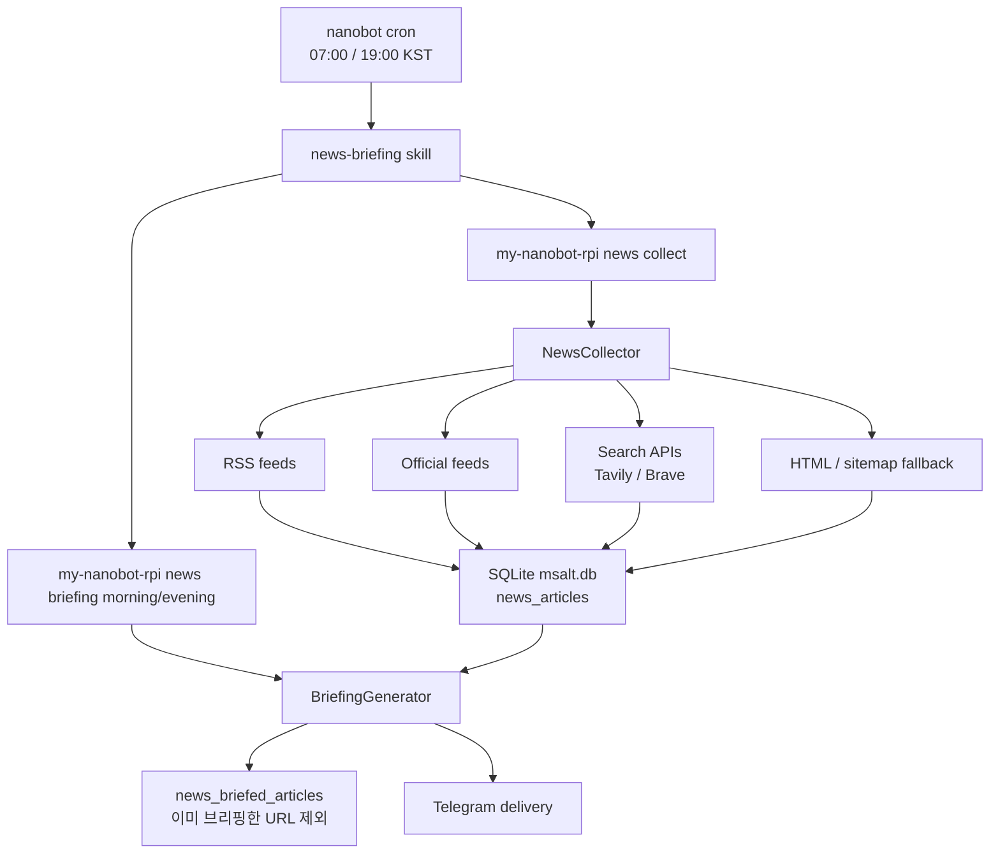

# News Collection and Briefing Pipeline

이 문서는 my-nanobot-rpi의 경제 뉴스 브리핑이 어떻게 기사를 수집하고, SQLite에 저장하고, 아침/저녁 보고서를 작성하고, 텔레그램으로 전달되는지 한 곳에 정리한다.

## 전체 흐름



정기 브리핑은 nanobot cron이 `news-briefing` 스킬을 실행하면서 시작된다. 스킬은 먼저 수집 명령을 실행하고, 그 다음 브리핑 생성 명령을 실행한다.

## 주요 파일

| 파일 | 역할 |
| --- | --- |
| `msalt/news/sources.json` | RSS, 공식기관 feed, 검색 API, fallback 소스 설정 |
| `msalt/news/collector.py` | 전체 수집 오케스트레이터 |
| `msalt/news/rss.py` | 일반 RSS/Atom 수집 |
| `msalt/news/official.py` | 한국은행, 금융위원회 등 공식기관 feed 수집 |
| `msalt/news/search.py` | Tavily, Brave Search API 기반 보강 수집 |
| `msalt/news/fallback.py` | RSS가 놓친 기사를 HTML 목록 또는 sitemap에서 보강 수집 |
| `msalt/news/briefing.py` | 수집된 기사로 아침/저녁 브리핑 생성 |
| `msalt/news/cli.py` | `collect`, `briefing`, `search` 내부 실행 함수 |
| `msalt/news/smoke.py` | 실제 외부 소스 연결 진단 |
| `msalt/storage.py` | SQLite 테이블 생성, 기사 저장, 브리핑 사용 이력 저장 |
| `msalt/skills/news/SKILL.md` | 대화형 뉴스 요청용 스킬 |
| `msalt/skills/news-briefing/SKILL.md` | 정기 브리핑용 스킬 |
| `msalt/workspace/cron/jobs.json` | 07:00/19:00 KST 자동 브리핑 job seed |

## 실행 명령

운영자는 아래 명령만 기억하면 된다.

```bash
my-nanobot-rpi doctor
my-nanobot-rpi news collect
my-nanobot-rpi news briefing
my-nanobot-rpi news briefing evening
my-nanobot-rpi news search "금리"
```

중요: 스킬 문서에서는 `python -m ...` 형태를 쓰지 않는다. nanobot의 exec 환경에서 venv 밖 Python으로 풀리면 `ModuleNotFoundError`가 날 수 있기 때문에 반드시 설치된 console script인 `my-nanobot-rpi ...`를 사용한다.

## 정기 실행

정기 브리핑 job은 `msalt/workspace/cron/jobs.json`에서 seed된다.

| job | 스케줄 | 메시지 |
| --- | --- | --- |
| `msalt-news-briefing-morning` | 매일 07:00 KST | 아침 경제 브리핑 생성 |
| `msalt-news-briefing-evening` | 매일 19:00 KST | 저녁 경제 브리핑 생성 |

실제 운영 중인 파일은 `~/.nanobot/workspace/cron/jobs.json`이다. `my-nanobot-rpi` 실행 또는 `my-nanobot-rpi doctor` 실행 시 `msalt/cli.py`의 seed 동기화 로직이 패키지의 최신 스킬과 cron 템플릿을 workspace에 반영한다. 기존 job의 `enabled`, `state`, 실행 이력은 보존한다.

## 수집 파이프라인

`NewsCollector.collect()`는 네 종류의 collector를 순서대로 실행한다.

1. `RssCollector`
2. `OfficialFeedCollector`
3. `SearchCollector`
4. `FallbackCollector`

각 collector는 표준 기사 dict를 반환한다.

```python
{
    "source": "한국경제",
    "title": "기사 제목",
    "url": "https://...",
    "summary": "요약 또는 설명",
    "category": "domestic",
    "published_at": "2026-05-23 01:00:00",
}
```

`published_at`은 UTC 기준 `YYYY-MM-DD HH:MM:SS` 문자열이다. 발행 시각을 신뢰할 수 없으면 `None`이 될 수 있다. 검색 API나 HTML fallback처럼 발행 시각이 없는 소스는 `sources.json`에서 `assume_current_if_missing: true`로 설정하면 수집 시각을 발행 시각처럼 채운다.

수집 단계에서는 먼저 메모리에서 URL 중복을 제거하고, 저장 단계에서는 SQLite의 `news_articles.url UNIQUE` 제약으로 다시 중복을 막는다. `Storage.insert_article()`은 실제 신규 저장이면 `True`, 이미 있던 URL이면 `False`를 반환한다. 따라서 `my-nanobot-rpi news collect`가 보여주는 수집 건수는 가져온 기사 수가 아니라 실제 신규 저장 건수다.

## 소스 설정

모든 수집 소스는 `msalt/news/sources.json`에 있다.

### RSS

`rss` 배열은 일반 언론사/뉴스 RSS를 정의한다.

```json
{
  "name": "한국경제",
  "url": "https://www.hankyung.com/feed/economy",
  "category": "domestic"
}
```

지원 필드:

| 필드 | 설명 |
| --- | --- |
| `name` | 저장 및 브리핑에 표시되는 소스명 |
| `url` | RSS/Atom URL |
| `category` | `domestic`, `international`, `policy` |
| `limit` | 피드에서 가져올 최대 기사 수 |
| `skip_title_patterns` | 제목 정규식 필터 |

### 공식기관 feed

`official_rss` 배열은 RSS와 같은 방식으로 수집하지만 정책/지표 신뢰도를 높이기 위해 별도 단계로 관리한다. 현재 한국은행 보도자료, 한국은행 통화정책, 금융위원회 보도자료가 들어 있다.

### 검색 API

`search` 배열은 Tavily와 Brave Search API를 사용한다.

필요 환경 변수:

```bash
TAVILY_API_KEY=...
BRAVE_API_KEY=...
```

지원 필드:

| 필드 | 설명 |
| --- | --- |
| `provider` | `tavily` 또는 `brave` |
| `query` | 검색어 |
| `category` | 저장 category |
| `api_key_env` | 기본값은 provider별 `TAVILY_API_KEY`, `BRAVE_API_KEY` |
| `days` | Tavily 뉴스 검색 기간 |
| `max_results` | Tavily 결과 수 |
| `count` | Brave 결과 수, 최대 20 |
| `freshness` | Brave freshness, 예: `pd` |
| `country`, `search_lang` | Brave 지역/언어 |
| `assume_current_if_missing` | 발행일 없을 때 현재 UTC 시각 사용 |

검색 API key가 없으면 해당 search source는 skip된다. `doctor`는 key가 없을 때 Search API를 실패가 아니라 skip으로 처리한다.

### HTML / sitemap fallback

`fallback` 배열은 RSS가 빈약하거나 깨졌을 때 HTML 목록 페이지 또는 sitemap에서 링크를 보강 수집한다.

지원 필드:

| 필드 | 설명 |
| --- | --- |
| `url` | HTML 목록 페이지 |
| `sitemap_url` | sitemap.xml URL |
| `link_patterns` | URL에 포함되어야 하는 문자열 목록 |
| `limit` | 최대 기사 수 |
| `max_sitemaps` | sitemap index에서 따라갈 하위 sitemap 수 |
| `min_title_length` | 너무 짧은 링크 텍스트 제외 |
| `assume_current_if_missing` | 발행일 없을 때 현재 UTC 시각 사용 |

HTML fallback은 정교한 본문 스크래퍼가 아니다. 목록 페이지의 `<a href="...">title</a>` 링크를 읽고, URL 패턴과 제목 길이로 기사 후보를 고른다. 사이트 구조가 바뀌면 가장 먼저 깨질 수 있는 계층이다.

## 저장소 스키마

SQLite DB 기본 경로는 `~/.nanobot/workspace/msalt.db`다.

### `news_articles`

수집된 기사 원본 테이블.

| 컬럼 | 설명 |
| --- | --- |
| `id` | 자동 증가 ID |
| `source` | 소스명 |
| `title` | 제목 |
| `url` | 원문 URL, UNIQUE |
| `summary` | RSS description 또는 검색 결과 설명 |
| `category` | `domestic`, `international`, `policy` |
| `collected_at` | SQLite UTC 수집 시각 |
| `published_at` | 외부 소스 발행 시각, UTC |

### `news_briefed_articles`

이미 브리핑에 사용한 기사 URL 기록 테이블.

| 컬럼 | 설명 |
| --- | --- |
| `article_url` | 브리핑에 사용된 URL, PRIMARY KEY |
| `briefing_label` | 예: `2026-05-23:morning`, `2026-05-23:evening` |
| `briefed_at` | SQLite UTC 기록 시각 |

이 테이블은 아침 브리핑에 사용한 URL이 저녁 브리핑에 다시 들어오는 문제를 막기 위해 추가됐다.

## 브리핑 생성

`BriefingGenerator.format_briefing(time_of_day)`가 최종 보고서를 만든다.

흐름:

1. 브리핑 시간창 계산
2. `news_articles`에서 후보 기사 조회
3. 이미 `news_briefed_articles`에 기록된 URL 제외
4. URL 기준 중복 제거
5. 카테고리별 최대 10개 선택
6. OpenAI로 카테고리별 요약
7. LLM 실패 시 단순 기사 목록으로 fallback
8. 실제 출력에 포함된 URL을 `news_briefed_articles`에 기록

브리핑 카테고리 순서:

1. 국내
2. 해외
3. 정책·지표

브리핑 시간창:

| 브리핑 | 후보 기사 기준 |
| --- | --- |
| 아침 | 전날 19:00 KST 이후 |
| 저녁 | 당일 07:00 KST 이후 |

이 시간창은 아침/저녁이 서로 같은 기사 풀을 과하게 공유하지 않도록 나눈다. 여기에 URL 사용 이력까지 더해져 같은 URL 반복을 막는다.

`published_at`이 없는 기사는 기본 브리핑 후보에서 제외된다. 이유는 RSS나 HTML 목록이 오래된 기사를 다시 노출할 수 있기 때문이다. 단, 검색 API/fallback 소스에서 `assume_current_if_missing: true`인 경우 수집 시각을 `published_at`으로 채워 브리핑 후보에 들어갈 수 있다.

## LLM 요약 규칙

`msalt/news/briefing.py`의 `SYSTEM_PROMPT`는 다음 원칙을 강제한다.

- 한국어 경제 뉴스 편집자 역할
- 카테고리별 핵심 흐름 요약
- 총 5문장 이내
- 사실만, 추측 금지
- 중복 헤드라인은 합치기
- 한 문장에 하나의 주제
- 숫자와 고유명사는 원문 그대로
- 각 문장 끝에 근거 기사 번호 표기

LLM 호출이 실패하면 `_format_plain()`으로 기사 제목, 요약, 원문 URL을 단순 나열한다.

## 대화형 검색

사용자가 뉴스 키워드를 물으면 `news` 스킬이 아래 명령을 사용한다.

```bash
my-nanobot-rpi news search "키워드"
```

`run_search()`는 `news_articles`에서 2020년 이후 기사 전체를 읽고, 제목 또는 summary에 키워드가 포함된 기사를 반환한다. 이 검색은 외부 검색 API를 호출하지 않고 로컬 DB만 검색한다.

## 진단과 운영

### 전체 진단

```bash
my-nanobot-rpi doctor
```

확인 항목:

- `.env` 로드 여부
- `OPENAI_API_KEY`, `TELEGRAM_BOT_TOKEN`, `TELEGRAM_USER_ID`
- 선택 키 `TAVILY_API_KEY`, `BRAVE_API_KEY`
- `~/.nanobot/config.json`
- workspace `SOUL.md`, `USER.md`
- cron jobs
- RSS, 공식기관 feed, Search API, Fallback 소스 연결

### 실제 소스 smoke test

```bash
python -m msalt.news.smoke
```

이 명령은 외부 네트워크를 실제로 호출한다. 단위 테스트에서는 외부 API를 mock하고, 실제 RSS/API/HTML 연결은 smoke test와 `doctor`에서 확인한다.

### 수동 수집

```bash
my-nanobot-rpi news collect
```

결과의 `뉴스 수집 완료: N건`은 신규 저장 건수다. 이미 저장된 URL은 중복으로 계산하지 않는다.

### 수동 브리핑

```bash
my-nanobot-rpi news briefing
my-nanobot-rpi news briefing evening
```

주의: 수동 브리핑도 기본적으로 `news_briefed_articles`에 사용 URL을 기록한다. 운영 확인만 하면서 기록을 남기고 싶지 않다면 코드 레벨에서 `BriefingGenerator.format_briefing(mark_as_briefed=False)`를 써야 한다. CLI에는 이 옵션이 노출되어 있지 않다.

### rpi 서비스 재시작

```bash
sudo systemctl restart my-nanobot-rpi.service
systemctl is-active my-nanobot-rpi.service
systemctl --no-pager --lines=20 status my-nanobot-rpi.service
```

## 장애 대응

### 브리핑에 같은 기사가 반복됨

확인할 것:

1. DB에 `news_briefed_articles` 테이블이 있는지 확인
2. 브리핑이 `format_briefing(mark_as_briefed=True)`로 실행되는지 확인
3. 같은 내용이지만 URL이 다른 기사인지 확인
4. `sources.json`의 search/fallback이 같은 기사에 다른 tracking URL을 붙이는지 확인

현재 반복 방지는 URL 기준이다. 같은 기사 내용이 서로 다른 URL로 들어오면 완전히 막지 못한다. 그 경우에는 제목 유사도나 canonical URL 정규화가 다음 개선 대상이다.

### `doctor`에서 특정 RSS/official source 실패

한 소스 실패는 전체 수집을 멈추지 않는다. `RssCollector`와 `OfficialFeedCollector`는 소스 단위로 예외를 격리한다.

대응:

1. 일시적인 연결 reset인지 재시도
2. URL이 바뀌었는지 확인
3. `sources.json`에서 해당 소스를 임시 비활성화하거나 URL 수정

### Search API가 skip됨

`TAVILY_API_KEY` 또는 `BRAVE_API_KEY`가 없으면 skip된다. `.env`에 키를 추가하고 서비스를 재시작한다.

### Fallback이 비거나 404

HTML fallback은 사이트 구조 변화에 약하다.

대응:

1. 브라우저로 `url` 확인
2. 기사 링크 URL 패턴 확인
3. `link_patterns` 수정
4. 필요하면 `sitemap_url` 방식으로 전환

## 테스트

관련 테스트:

```bash
python -m pytest tests/msalt/news tests/msalt/test_storage.py tests/msalt/test_cli.py
python -m ruff check msalt/news msalt/storage.py msalt/cli.py tests/msalt/news tests/msalt/test_storage.py tests/msalt/test_cli.py
```

주요 테스트 범위:

- RSS 파싱, HTTP 실패, bozo feed 처리
- 검색 API 응답 변환과 key 누락 skip
- HTML/sitemap fallback 링크 추출
- 공식기관 feed 위임
- 수집 오케스트레이션과 중복 URL 처리
- `news_articles`, `news_briefed_articles` 스키마와 마이그레이션
- 브리핑 중복 URL 제외
- 아침/저녁 시간창 분리
- LLM 호출 성공/실패 fallback

## 현재 한계와 개선 후보

- 반복 방지는 URL 기준이라 같은 기사의 다른 URL까지는 완전히 막지 못한다.
- HTML fallback은 본문을 읽지 않고 목록 링크만 읽는다.
- 검색 API 결과는 provider 품질에 따라 경제 뉴스가 아닌 페이지가 섞일 수 있다.
- 브리핑 후보 선택은 카테고리별 최신순 최대 10개이며 중요도 랭킹은 없다.
- 수동 CLI 브리핑에는 `mark_as_briefed=False` 옵션이 없다.
- `news_briefed_articles` 이력 보존 기간 제한이 없다.

다음 개선 후보:

- canonical URL 정규화
- 제목 유사도 기반 중복 제거
- 검색 API 결과 도메인 allow/deny list
- 브리핑 중요도 랭킹
- 오래된 `news_briefed_articles` 이력 정리 job
- CLI에 dry-run 브리핑 옵션 추가
